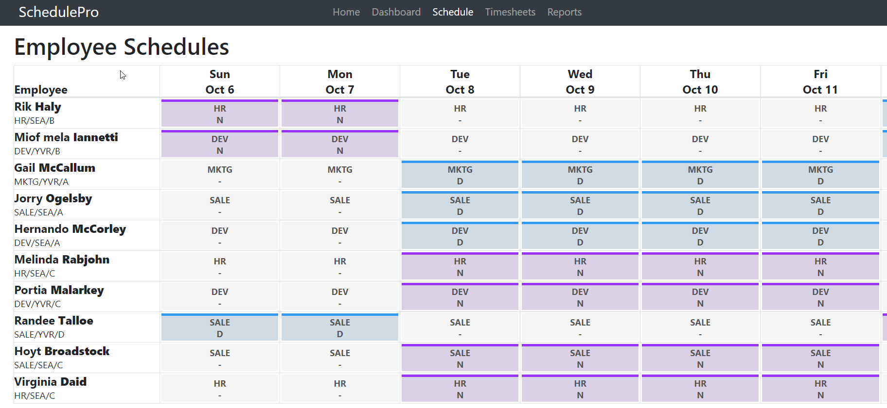

# Introduction 
Thank you for investing the time to complete SchedulePro's code test. This test has been designed to allow you to get a taste of some of the work that we do here at SchedulePro. Instead of developing a tedious and time-consuming algorithm, you'll be addressing a critical customer pain within an existing scheduling application. We hope that you get a solid understanding of the position available at SchedulePro, while having a platform to showcase your development skills.

Once you've completed the code test, please compress the root folder into a single zip file (ex. "{name} schedulepro.zip"), and send the file to the SchedulePro member who assigned you the test. The code test will then be used for further discussion. There is also a [list of questions](#Questions) that we would love for you to fill out if you have the time. Please fill out the [Answers to questions.md](#Answers-to-questions.md) file with your answers before submitting the test.

# Getting Started
The application is a single web page that can be accessed through `index.html` in any modern browser. It requires no server or other external dependencies to run. The application has been built without using a JavaScript framework (e.g.; React, Vue, Angular), but does require JQuery/Bootstrap on the front-end. The application also leverages a popular third party library [moment.js](#https://momentjs.com/), which provides a comprehensive toolset for parsing and manipulating dates in JavaScript. You should be able to complete the code test as-is, but feel free to add any libraries or tools that you're comfortable with.

## The Front End
The application displays a 14-day schedule for 10 employees, and allows users to make edits to individual employee shifts. A shift is composed of three modifiable properties:

- Location (ex. Vancouver, Seattle)
- Position (ex. Developer, Sales)
- Shift code (ex. Day, Night, "Not Working")

The schedule is dynamically generated with JavaScript, looping through the schedule of each employee to build an HTML table grid of shifts. The `*.controller.js` classes are responsible for building out the UI from data provided by the back-end.

Note, an employee has a single shift for **every** day. When the employee is not working on the day, the shift code of their shift is denoted as "-", or "Not Working". These shifts are displayed as grey shifts. A user can add an employee to a working shift by changing the "-" shift code to a working shift code (ex. Day or Night).

## The "Back" End
To keep things simple, data is stored within JavaScript files on the client-side. The `*.repository.js` classes provide an interface to the raw data. We've added a timeout within these classes to simulate network latency. The `schedule.service.js` class is responsible for getting shift data to the front-end and recording any schedule updates made by the user.

# Problem Definition
To reduce the number of accidents in refineries due to fatigue, schedule managers in Oil & Gas worksites must ensure that all employees adhere to the industry's fatigue rules. The rules include, but are not limited to the following:
-   Employees must take an X day break before working Y number of shifts (days) in a row.
-   Employees cannot work more than X number of hours in a row. 
-   Employees must be qualified to work at position X.

Trying to manage these work rules within our current application is almost impossible. There are no restrictions in the current UI/UX that prevents the user from making scheduling decisions that violate the rules. Trying to detect these violations through visual inspection for > 100 employees can be extremely tedious and inaccurate.

#### This is where you come in. 

For this code test, you'll be incorporating a simplified version of a fatigue rule within the existing application. You will be designing and implementing a solution to the following user story:

    As a scheduler manager working with SchedulePro
    I am prevented from assigning an employee to more than 5 shifts (days) in a row
    So that I can ensure my schedule is 100% fatigue compliant.

Your job will be to develop new functionality that detects whenever an employee is working more than 5 shifts in a row, and displays a notification/alert when the user is prevented from making a shift update. The functionality must not break existing behaviour, and the architecture of the application must not change significantly.

# Tips
1.  **Ask questions.** We'll always be available to answer any of your questions or concerns as you work through the test.
2.  **Keep it simple.** We've built out the majority of the application so you don't have to worry about building it from scratch.
3.  **Don't be afraid to be creative.** There are no rules as to how the user story is solved, feel free to think outside the box.
4.  **Try to focus on the defined user story.** There's a lot of improvements that can be made to the application, but nailing the user story is top priority.

# Questions
1.  How much time did you spend on the coding test? What would you have improved, or done differently, if you had more time? 
2.  What changes would you make to the application to increase its overall performance?
3.  What did you think of the code test? How could we improve the test?
4.  What is your favourite superpower?

# Screenshot

